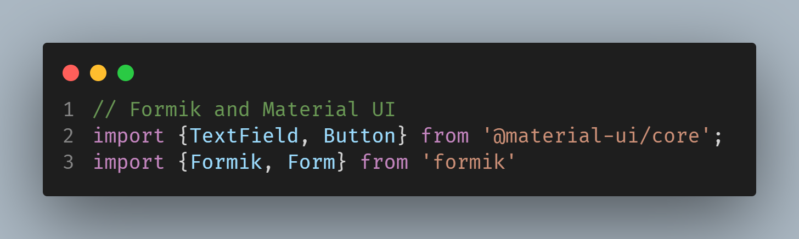

# React Form with Formik, Material UI

This project was built with [Create React App](https://github.com/facebook/create-react-app), and is written in TypeScript.
I chose TypeScript as the my preferable language for creating the project by running:

```> yarn create react-app my-app --template typescript```

Yarn was the package manger I used in the project.
## Installation

Just incase you want to use this TypeScript boilerplate for your application.
Clone this repository:
```> git clone https://github.com/grayoj/reactjs-typescript-form.git```

Install all dependencies, using ``yarn add``



Install formik and Material UI using ``yarn add formik`` and ``yarn add @material-ui/core`` respectively.

Run this to launch the project:

`yarn start`

Starts the local server
Open [http://localhost:3000](http://localhost:3000) to view it in the browser.

## Enjoy
Reach out to me. geraldabuchi@twitter.com

